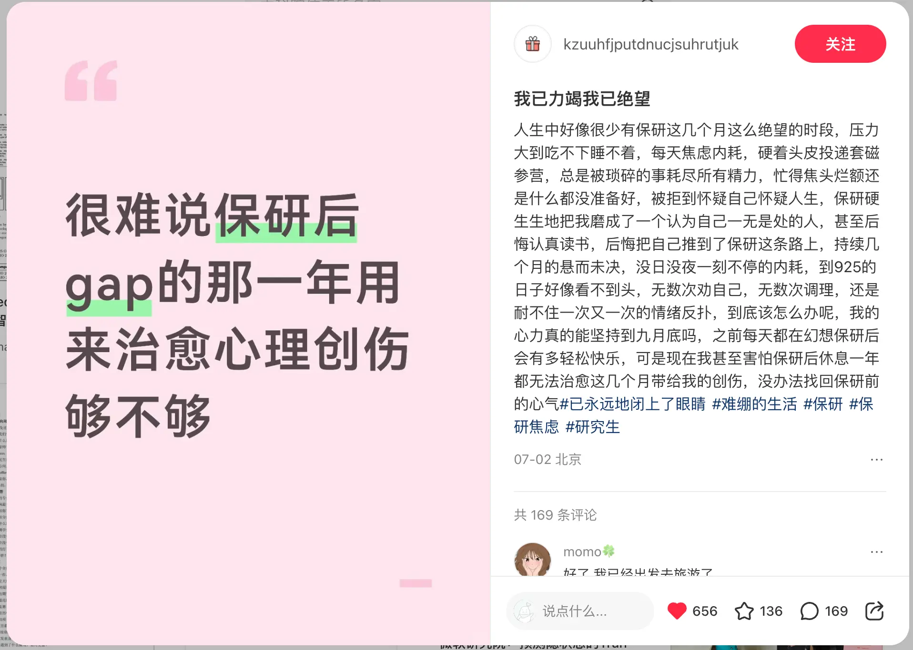

保研路上值得收藏的信息源、经验与工具，汇总在这一篇里持续更新。

## 推荐资源

### 资源分享类

- [CSWIKI](https://csbaoyan.top/)：规模最大、最权威的保研资源库网站，包含大量保研经验、材料和信息，覆盖全国各大高校和专业。虽然主要针对 CS 学生，对其他专业学生也有很大参考价值。
- [强弱 com 汇总](http://t.cn/A6EgfCAC)：各个学校各个学院的强弱 com，但时间较早，部分信息可能过时；也可在 [CSWIKI 院校解析](https://csbaoyan.top/%E4%BF%9D%E7%A0%94%E6%8C%87%E5%8D%97/%E9%99%A2%E6%A0%A1%E8%A7%A3%E6%9E%90/) 找到相关信息。

### 夏令营信息获取类

- [csbaoyan-ddl](https://ddl.csbaoyan.top/)：由 CSWIKI 维护的保研信息发布平台，提供最新夏令营预推免信息，一般每年四月中旬到下旬开始维护更新。
- [申研派](https://github.com/shenyanpai) / [保研通知网](https://www.baoyantongzhi.com/notice)：由第三方保研机构创建，信息最全、更新最及时的平台之一。
- **保研岛**：微信小程序，同样为夏令营预推免信息发布平台，但由第三方机构运营，存在部分推销。

### 导师评价类

- [CSWIKI 导师评价导览](https://csbaoyan.top/%E4%BF%9D%E7%A0%94%E5%B7%A5%E5%85%B7%E7%AE%B1/%E5%AF%BC%E5%B8%88%E6%8E%A8%E8%8D%90%E7%BD%91/)。
- [导师评价网站汇总](https://zhuanlan.zhihu.com/p/514592085)：知乎导航文章，汇总了现存导师评价网站及介绍。
- [导师评价网](https://daoshipingjia.net/)：收费网站，覆盖全国各大高校和专业。
- [研控](https://www.yankong.org/review)：免费导师评价网站，需翻墙访问。

### 心理疏导类

> 待完善。欢迎推荐保研过程中的心态调整文章、播客或工具。

## 经验分享

经验分享的价值不只在「去了哪里」，更在「怎么判断、怎么准备、哪里踩坑」。本站鼓励记录有上下文的真实经历。

### 建议包含

- 申请年份、专业方向和本科背景概况。
- 成绩排名、英语、科研、竞赛、项目等基本情况。
- 投递院校和批次。
- 材料准备过程。
- 面试形式和题目。
- 最终选择与取舍。
- 遗憾、建议和想提醒后来者的事。

### 写作原则

- 可以匿名或模糊敏感信息。
- 不泄露未公开的面试材料和他人隐私。
- 尽量区分事实、感受和个人判断。
- 对失败经历同样友好，因为它们常常更有参考价值。

### 经验稿模板

可以复制以下结构作为经验稿初稿，再根据自己的申请过程调整。

#### 基本信息

- 申请年份：
- 本科院校与专业：
- 申请方向：
- 成绩与排名：
- 英语情况：
- 科研 / 竞赛 / 项目概况：

#### 投递情况

| 院校 | 学院/专业 | 批次 | 结果 | 备注 |
| --- | --- | --- | --- | --- |
| 示例大学 | 示例学院 | 夏令营 | 入营/未入营/优秀营员 | 面试形式 |

#### 材料准备

说明简历、个人陈述、推荐信和证明材料的准备方式，以及哪些材料后续反复修改。

#### 面试记录

- 自我介绍形式：
- 专业课问题：
- 英语问题：
- 科研或项目追问：
- 其他问题：

#### 最终选择

说明最终选择的院校、专业或导师，以及你考虑的平台、方向、城市、培养方式、风险等因素。

#### 给后来者的建议

写下你认为最值得提前做的事、最容易忽视的事，以及如果重来一次会怎么调整。

## 个人感悟

### 你越淡定，保研就越顺

> 转自[小红书](https://www.xiaohongshu.com/discovery/item/6a4362e8000000000803c18b?source=webshare&xhsshare=pc_web&xsec_token=ABC6U45wDvYkh5cZzlZPbpxwOe7e3f6pPCUFVD5VLfchY=&xsec_source=pc_share)

很多大三同学准备夏令营面试时，会把自己逼得特别紧。自我介绍背了十几遍，还是怕卡壳；简历翻来翻去，还是担心老师追问；经验帖收藏了一堆，越看越觉得自己没准备好。

但我想说一句有点反直觉的话：**保研面试里，真正容易走顺的人，往往不是准备得最「满」的人，而是状态最稳的人。**

这里的淡定，不是天生自信，也不是不在乎，而是你知道：保研面试不是一场标准答案考试，它更像是一场高密度的学术对话。老师不是等你背出一篇完美稿子，而是在判断几件事：

- 你简历上的经历，是不是真的做过；
- 你说感兴趣的方向，是不是真的理解；
- 你被追问时，能不能把思路拆开讲清楚；
- 你遇到不会的问题，会不会硬编。

很多同学紧张，本质上不是能力差，而是心里没有结构。你不知道老师会问什么，不知道被追问怎么接，也不知道一个问题该从哪里开始讲，所以每个问题都像一次风险。

但如果你提前把问题分好类，状态就会完全不一样：

- **自我介绍**，不是把简历从头念一遍，而是讲清你的身份、优势和申请方向。
- **科研项目**，不是说「我参与了」，而是讲清问题是什么、你做了什么、为什么这么做、结果说明什么。
- **竞赛经历**，不是只说「我拿了奖」，而是讲清你负责哪一块、项目逻辑是什么、最后有什么结果。
- **院校匹配**，也不是只说「贵校平台好」，而是讲清你为什么适合这个方向。

真正的转折点，不是你又多背了几道题，而是你从「我一定要答对」，变成了「我知道这类问题该怎么讲」。

老师其实很能感受到这种状态。有些学生说得很快、看起来很流利，但一追问细节就开始绕；有些学生一开始没那么惊艳，但回答有结构，知道自己做过什么，也知道自己没做到哪里。后者反而更容易给老师留下稳定、真实、可培养的印象。

所以面试前，别只想着背模板。你要把简历、科研、竞赛、项目经历一条条拿出来压测：

- 我具体做了什么？
- 我为什么这样做？
- 这个结果说明了什么？

这三句话能讲清，很多追问就没那么吓人。淡定不是装出来的，淡定是你知道自己为什么这样说，也知道老师继续追问时，下一步可以怎么接。

7 月开始，很多保研人已经陆续进入夏令营和面试阶段了。这个时候别再只收藏攻略了，你真正要练的，是在老师追问你的时候，依然能把自己讲清楚。

### 心理创伤这块儿 /.

