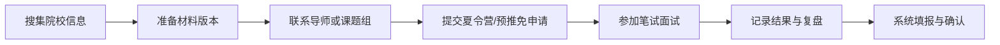

# 申请流程

申请流程的核心是信息管理。保研不是单线任务，而是多个院校、多个批次、多个材料版本和多个面试时间同时推进。

## 流程概览

## 建议表格字段

- 院校与学院。
- 专业方向。
- 导师或课题组。
- 批次类型。
- 截止时间。
- 材料清单。
- 提交状态。
- 面试时间。
- 结果与备注。

## 推荐阅读

- [信息搜集](./information-collection)
- [联系导师](./contact-supervisors)
- [院校投递策略](./school-strategy)
